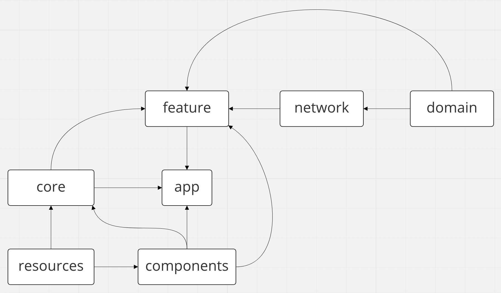

# Структура модулей приложения

[Miro](https://miro.com/app/board/uXjVOJ4IDik=/?invite_link_id=19500664330)

* `app` - основной компонент приложения
* `resources` - модуль, централизованно поставляющий ресурсы, решается проблема их дублирования в разных модулях
* `components` - базовые ui-компоненты приложения, здесь полностью задаются стили composable и реализации основных компонентов
* `core` - базовые компоненты остальных модулей
* `features` - директория группирует основные независимые фичи приложения, разбитые на модули, нужно избегать излишнего дробления
* `domain` - доменный слой всего приложения, подлежит кодогенерации
* `network` - базовый сетевой слой приложения, подлежит кодогенерации
* `debug`, `debug_no_op` - дебажные настройки
* `test_utils` - содержит основные утилиты для написания unit-тестов